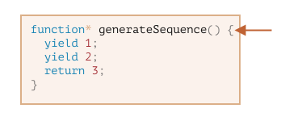
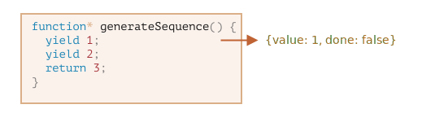
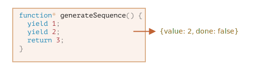
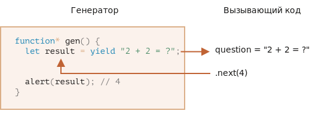
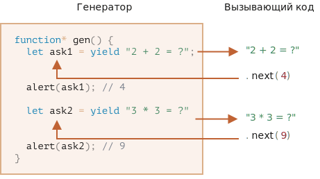

<link href="../styles.css" rel="stylesheet" />

# Специальные объекты

- [Итераторы](#итераторы)
  - [Получение итератора](#получение-итератора)
  - [Метод next итераторов](#метод-next-итераторов)
  - [Создание своего итератора](#создание-своего-итератора)
  - [Создание итерируемых объектов](#создание-итерируемых-объектов)
- [Генераторы](#генераторы)
  - [Функция-генератор](#функция-генератор)
    - [Перебор генераторов](#перебор-генераторов)
    - [Использование генераторов для перебираемых объектов](#использование-генераторов-для-перебираемых-объектов)
    - [Композиция генераторов](#композиция-генераторов)
    - [yield – дорога в обе стороны](#yield--дорога-в-обе-стороны)
    - [generator.throw](#generatorthrow)
    - [Итого](#итого)
    - [Задачи](#задачи)
      - [Псевдослучайный генератор](#псевдослучайный-генератор)
- [Глоссарий](#глоссарий)
- [Источники данных](#источники-данных)

## Итераторы
<dfn title="итераторы">Итераторы</dfn> представляют абстракцию для перебора наборов данных и применяются для организации последовательного доступа к элементам наборов данных — массивам, объектам `Set`, `Map`, строкам и т.д. Так, благодаря итераторам мы можем перебрать набор данных (например, массив) с помощью цикла **`for-of`**:
```js
const people = ["Tom", "Bob", "Sam"];
for(const person of people){
    console.log(person);
}
```

В цикле **`for-of`** справа от оператора **`of`** указывается набор данных или перебираемый объект (то, что назвается **`Iterable`**), из которого в цикле мы можем получить отдельные элементы. Но эта возможность перебора некоторого объекта, как, например, массива в примере выше, реализуются благодаря тому, что эти объекты применяют итераторы. Рассмотрим подробнее, что представляют итераторы и как можно создать свой итератор.[^14.1]

### Получение итератора
Любой итерируемый объект (например, массив, `Map`, `Set` и т.д.) хранит в свойстве `Symbol.iterator` функцию, которая возвращает связанный с объектом итератор:
```js
const people = ["Tom", "Bob", "Sam"];
// получаем итератор массива
const iterator = people[Symbol.iterator]();
console.log(iterator);  // Array Iterator {}
```

Здесь получаем итератор массива, поэтому на консоль будет выведено что-то наподобие `Array Iterator {}`

Другой пример — строка тоже представляет перебираемый объект, которую можно перебрать посимвольно:
```js
const username = "Tom";
for(char of username){
    console.log(char);
}
```

Соответственно для строки мы тоже можем получить итератор:
```js
const username = "Tom";
// получаем итератор строки
const iterator = username[Symbol.iterator]();
console.log(iterator);  // StringIterator {}
```

Итератор строки представляет тип `StringIterator`. Аналогичным образом можно получать итераторы и для других типов перебираемых объектов.

Стоит отметить, что у различных типов могут быть различные дополнительные методы для получения итератора. Например, у массивов есть метод **`entries()`**, который также возвращает итератор массива:
```js
const people = ["Tom", "Bob", "Sam"];
console.log(people.entries()); // Array Iterator {}
```

### Метод next итераторов
Итераторы предоставляют метод **`next()`**, который возвращает объект с двумя свойствами: **`value`** и **`done`**
```js
{value, done}
```

Свойство **`value`** хранит собственно значение текущего перебираемого элемента. А свойство **`done`** указывает, есть ли еще в коллекции объекты, доступные для перебора. Если в наборе еще есть элементы, то свойство `done` равно `false`. Если же доступных элементов для перебора больше нет, то это свойство равно **`true`**, а метод `next()` возвращает объект
```js
{done: true}
```

Например:
```js
const people = ["Tom", "Bob", "Sam"];
const iter = people[Symbol.iterator]();
const result = iter.next();
console.log(result);    // {value: "Tom", done: false}
```

В данном случае вызываем метод `next()` и получаем из итератора первыый результат:
```
{value: "Tom", done: false}
```

Здесь мы видим, что текущий объект представляет строку "Tom", а значение `done: false` указывает, что в массиве еще есть элементы для перебора.

Мы можем последовательно несколько раз вызвать метод `next()` для получения других элементов массива:
```js
const people = ["Tom", "Bob", "Sam"];
const iter = people[Symbol.iterator]();
console.log(iter.next());    // {value: "Tom", done: false}
console.log(iter.next());    // {value: "Bob", done: false}
console.log(iter.next());    // {value: "Sam", done: false}
console.log(iter.next());    // {value: undefined, done: true}
```

Консольный вывод программы:
```
{value: "Tom", done: false}
{value: "Bob", done: false}
{value: "Sam", done: false}
{value: undefined, done: true}
```

Здесь мы видим, что при каждом новом вызове метода `next()` мы получаем из массива следующий объект. А когда объектов для перебора больше не останется, то свойство `done` будет равно `true`.

Используя метод `next()`, мы сами можем перебрать все объекты массива:
```js
const people = ["Tom", "Bob", "Sam"];
const iter = people[Symbol.iterator]();
while(!(item = iter.next()).done){
    console.log(item.value);
}
```

Здесь в цикле `while` из метода `next()` итератора получаем текущий объект в переменную `item`: `item = items.next()`.

И смотрим на ее свойство `done` — если оно равно `false` (то есть в наборе еще есть элементы), то продолжаем цикл
```js
while(!(item = iter.next()).done){
```

В цикле обращаемся к свойству value полученного объекта
```js
console.log(item.value);
```

Консольный вывод:
```
Tom
Bob
Sam
```

Но в этом нет смысла, поскольку все коллекции, которые возвращают итераторы, поддерживают перебор с помощью цикла **`for...of`**, который как раз и использует итератор для получения элементов.

### Создание своего итератора
Для примера реализуем итератор, который перебирает массив с конца:
```js
const people = ["Tom", "Bob", "Sam"];

function reverseArrayIterator(array) {
    let count = array.length;
    return {
        next: function(){
            if (count > 0) {
                return {
                    value: array[--count],
                    done: false
                };
            }
            else {
                return {
                    value: undefined,
                    done: true
                };
            }
        }
    }
};
const iter = reverseArrayIterator(people);
while(!(item = iter.next()).done){
    console.log(item.value);
}
```

Здесь сначала инициализируется переменная `count`, которая количество перебранных элементов массива. Первоначально переменная имеет значение, равное длине массива.

Далее функция возвращает объект итератора. Его метод `next()` реализует поведение итерации: если счетчик `count` больше 0 (то есть имеются еще элементы для перебора), то `next()` возвращает объект, свойство `done` которого имеет значение `false` (поскольку итератор еще не достиг конца или точнее начала массива), а свойство `value` содержит соответствующий элемент из массива, на который указывает переменная `count` после декремента.

Когда переменная `count` станет равна 0 (т. е. итератор достиг конца), `next()` возвращает объект, у которого свойство `done` имеет значение `true`, а свойство `value` имеет значение `undefined`.

Таким образом, мы получим итератор, который перебирает объекты массива с конца. Консольный вывод:
```
Sam
Bob
Tom
```

Однако при выполнении цикла **`for..of`** элементы массива по прежнему перебираются с начала. Применим наш итератор глобально, чтобы он также использовался в цикле **`for..of`**:
```js
const people = ["Tom", "Bob", "Sam"];

function reverseArrayIterator() {
    const array = this;
    let count = array.length;
    return {
        next: function(){
            if (count > 0) {
                return {
                    value: array[--count],
                    done: false
                };
            }
            else {
                return {
                    value: undefined,
                    done: true
                };
            }
        }
    }
};
// меняем итератор для массива people
people[Symbol.iterator]=reverseArrayIterator;
for(person of people){
    console.log(person);
}
```

Здесь сделано два ключевых изменения. Во-первых, нам надо внутри итератора получить текущий объект через **`this`**:
```js
const array = this;
```

Созданную функцию итератора надо присвоить свойству `Symbol.iterator`:
```js
people[Symbol.iterator]=reverseArrayIterator;
```

### Создание итерируемых объектов
Разные объекты могут иметь свою собственную реализацию итератора. И при необходимости мы можем определить объект со своим итератором. Применение итераторов предоставляет нам способ создать объект, который будет вести себя как коллекция элементов

Для создания перебираемого объекта нам надо определить в объекта метод **`[Symbol.iterator]()`**. Этот метод собственно и будет представлять итератор:
```js
const iterable = {
  [Symbol.iterator]() {
    return {
      next() {
            // если еще есть элементы
            return { value: ..., done: false };
            // если больше нет элементов
            return { value: undefined, done: true };
      }
    };
  }
};
```

Метод **`[Symbol.iterator]()`** возвращает объект, который имеет метод **`next()`**. Этот метод возвращает объект с двумя свойствами `value` и `done`.

Если в нашем объекте есть элементы, то свойство `value` содержит собственно значение элемента, а свойство done равно `false`.

Если доступных элементов больше нет, то свойство `done` равно `true`.

Например, реализуем простейший объект с итератором, который возвращает некоторый набор чисел:
```js
const iterable = {
  [Symbol.iterator]() {
    return {
      current: 1,
      end: 3,
      next() {
        if (this.current <= this.end) {
          return { value: this.current++, done: false };
        }
        return { done: true };
      }
    };
  }
};
```

Здесь итератор фактически возвращает числе от 1 до 3. Для отслеживания текущего элемента в объекте, который возвращается методом , определены два свойства:
```js
current: 1,
end: 3,
```

Свойство `current` собственно хранит значение текущего элемента. А свойство `end` задает предел. То есть в данном случае итератор возвращает числа от 1 до 3.

В методе `next()`, если текущее значение меньше или равно редельному значению, возвращаем объект
```js
return { value: this.current++, done: false };
```

Инкремент `this.current++` приведет к тому, что при следующем вызове метода `next` значение `current` будет на единицу больше.

Если достигнут предел, то возвращаем объект
```js
return { done: true };
```

Это будет указывать, что объектов больше нет.

Получим из итератора возвращаемые им элементы:
```js
const myIterator = iterable[Symbol.iterator](); // получаем итератор
console.log(myIterator.next()); // {value: 1, done: false}
console.log(myIterator.next()); // {value: 2, done: false}
console.log(myIterator.next()); // {value: 3, done: false}
console.log(myIterator.next()); // {done: true}
```

Здесь сначала получаем итератор в константу `myIterator`. Затем при обращении к ее методу `next()` последовательно получаем все элементы. При четвертом вызове метода `next` условный перебор элементов в итераторе закончен, и метод возвращает объект `{done: true}`.

Однако если мы хотим перебрать наш объект и получить из него его элементы, то нам не надо обращаться к методу `next()`. Поскольку объект `iterable` реализует итератор, то его можно перебрать с помощью цикла **`for-of`**:
```js
const iterable = {
  [Symbol.iterator]() {
    return {
      current: 1,
      end: 3,
      next() {
        if (this.current <= this.end) {
          return { value: this.current++, done: false };
        }
        return { done: true };
      }
    };
  }
};
for (const value of iterable) {
  console.log(value);
}
```

Консольный вывод:
```
1
2
3
```

Цикл `for-of` автоматически обращается к методу `next()` и извлекает значение.

Рассмотрим еще один пример:
```js
// объект-компания
const company = {
    // массив работников
    employees: [
        {name: "Tom", age: 39, position: "Senior Developer"},
        {name: "Bob", age: 43, position: "Middle Developer"},
        {name: "Sam", age: 28, position: "Junior Developer"},
    ]
};
// устанавливаем итератор
company[Symbol.iterator] = function() {
    const array = this.employees; // получаем массив работников
    let current = 0;
    return {
      next() {
        if (current < array.length) {
          return { value: array[current++].name, done: false };
        }
        return { value:undefined, done: true };
      }
    };
  };
for (const employee of company) {
  console.log(employee);
}
```

Здесь объект `company` представляет условную компанию, в которой есть массив работников — массив `employee`. Допустим, с помощью итератора мы хотим получать имя каждого работника. Для этого для объекта company устанавливаем функцию итератора, которая перебирает все элементы из массива `employees`. Консольный вывод программы:
```
Tom
Bob
Sam
```

## Генераторы
Обычные функции возвращают только одно-единственное значение (или ничего).

Генераторы могут порождать (*yield*) множество значений одно за другим, по мере необходимости. Генераторы отлично работают с перебираемыми объектами и позволяют легко создавать потоки данных.[^generators]

### Функция-генератор
Для объявления генератора используется специальная синтаксическая конструкция: `function*`, которая называется «функция-генератор».

Выглядит она так:
```js
function* generateSequence() {
  yield 1;
  yield 2;
  return 3;
}
```

Функции-генераторы ведут себя не так, как обычные. Когда такая функция вызвана, она не выполняет свой код. Вместо этого она возвращает специальный объект, так называемый «генератор», для управления её выполнением.

Вот, посмотрите:
```js
function* generateSequence() {
  yield 1;
  yield 2;
  return 3;
}

// "функция-генератор" создаёт объект "генератор"
let generator = generateSequence();
alert(generator); // [object Generator]
```

Выполнение кода функции ещё не началось:



Основным методом генератора является `next()`. При вызове он запускает выполнение кода до ближайшей инструкции `yield <значение>` (значение может отсутствовать, в этом случае оно предполагается равным `undefined`). По достижении `yield` выполнение функции приостанавливается, а соответствующее значение – возвращается во внешний код:

Результатом метода `next()` всегда является объект с двумя свойствами:

- `value`: значение из `yield`.
- `done: true`, если выполнение функции завершено, иначе `false`.

Например, здесь мы создаём генератор и получаем первое из возвращаемых им значений:
```js
function* generateSequence() {
  yield 1;
  yield 2;
  return 3;
}

let generator = generateSequence();

let one = generator.next();

alert(JSON.stringify(one)); // {value: 1, done: false}
```

На данный момент мы получили только первое значение, выполнение функции остановлено на второй строке:



Повторный вызов `generator.next()` возобновит выполнение кода и вернёт результат следующего `yield`:
```js
let two = generator.next();

alert(JSON.stringify(two)); // {value: 2, done: false}
```



И, наконец, последний вызов завершит выполнение функции и вернёт результат `return`:
```js
let three = generator.next();

alert(JSON.stringify(three)); // {value: 3, done: true}
```


Сейчас генератор полностью выполнен. Мы можем увидеть это по свойству `done:true` и обработать `value:3` как окончательный результат.

Новые вызовы `generator.next()` больше не имеют смысла. Впрочем, если они и будут, то не вызовут ошибки, но будут возвращать один и тот же объект: `{done: true}`.

!!! info "`function* f(…)` или `function *f(…)`?"
    Нет разницы, оба синтаксиса корректны.

    Но обычно предпочтителен первый вариант, так как звёздочка относится к типу объявляемой сущности (`function*` – «функция-генератор»), а не к её названию, так что резонно расположить её у слова `function`.

#### Перебор генераторов
Как вы, наверное, уже догадались по наличию метода `next()`, генераторы являются перебираемыми объектами.

Возвращаемые ими значения можно перебирать через `for..of`:
```js
function* generateSequence() {
  yield 1;
  yield 2;
  return 3;
}

let generator = generateSequence();

for(let value of generator) {
  alert(value); // 1, затем 2
}
```

Выглядит гораздо красивее, чем использование `.next().value`, верно?

…Но обратите внимание: пример выше выводит значение `1`, затем `2`. Значение `3` выведено не будет!

Это из-за того, что перебор через `for..of` игнорирует последнее значение, при котором `done: true`. Поэтому, если мы хотим, чтобы были все значения при переборе через `for..of`, то надо возвращать их через `yield`:
```js
function* generateSequence() {
  yield 1;
  yield 2;
  yield 3;
}

let generator = generateSequence();

for(let value of generator) {
  alert(value); // 1, затем 2, затем 3
}
```

Так как генераторы являются перебираемыми объектами, мы можем использовать всю связанную с ними функциональность, например оператор расширения `...`:
```js
function* generateSequence() {
  yield 1;
  yield 2;
  yield 3;
}

let sequence = [0, ...generateSequence()];

alert(sequence); // 0, 1, 2, 3
```

В коде выше `...generateSequence()` превращает перебираемый объект-генератор в массив элементов.

#### Использование генераторов для перебираемых объектов
Некоторое время назад, в разделе, посвященном перебираемым объектам, мы создали перебираемый объект `range`, который возвращает значения `from..to`.

Давайте вспомним код:
```js
let range = {
  from: 1,
  to: 5,

  // for..of range вызывает этот метод один раз в самом начале
  [Symbol.iterator]() {
    // ...он возвращает перебираемый объект:
    // далее for..of работает только с этим объектом, запрашивая следующие значения
    return {
      current: this.from,
      last: this.to,

      // next() вызывается при каждой итерации цикла for..of
      next() {
        // нужно вернуть значение как объект {done:.., value :...}
        if (this.current <= this.last) {
          return { done: false, value: this.current++ };
        } else {
          return { done: true };
        }
      }
    };
  }
};

// при переборе объекта range будут выведены числа от range.from до range.to
alert([...range]); // 1,2,3,4,5
```

Мы можем использовать функцию-генератор для итерации, указав её в `Symbol.iterator`.

Вот тот же `range`, но с гораздо более компактным итератором:
```js
let range = {
  from: 1,
  to: 5,

  *[Symbol.iterator]() { // краткая запись для [Symbol.iterator]: function*()
    for(let value = this.from; value <= this.to; value++) {
      yield value;
    }
  }
};

alert( [...range] ); // 1,2,3,4,5
```

Это работает, потому что `range[Symbol.iterator]()` теперь возвращает генератор, и его методы – в точности то, что ожидает `for..of`:

- у него есть метод `.next()`
- который возвращает значения в виде `{value: ..., done: true/false}`

Это не совпадение, конечно. Генераторы были добавлены в язык JavaScript, в частности, с целью упростить создание перебираемых объектов.

Вариант с генератором намного короче, чем исходный вариант перебираемого `range`, и сохраняет те же функциональные возможности.

!!! info "Генераторы могут генерировать бесконечно"
    В примерах выше мы генерировали конечные последовательности, но мы также можем сделать генератор, который будет возвращать значения бесконечно. Например, бесконечная последовательность псевдослучайных чисел.

    Конечно, нам потребуется `break` (или `return`) в цикле `for..of` по такому генератору, иначе цикл будет продолжаться бесконечно, и скрипт «зависнет».

#### Композиция генераторов
<dfn title="композиция генераторов">Композиция генераторов</dfn> – это особенная возможность генераторов, которая позволяет прозрачно «встраивать» генераторы друг в друга.

Например, у нас есть функция для генерации последовательности чисел:
```js
function* generateSequence(start, end) {
  for (let i = start; i <= end; i++) yield i;
}
```

Мы хотели бы использовать её при генерации более сложной последовательности:

- сначала цифры `0..9` (с кодами символов 48…57)
- за которыми следуют буквы в верхнем регистре `A..Z` (коды символов 65…90)
- за которыми следуют буквы алфавита `a..z` (коды символов 97…122)

Мы можем использовать такую последовательность для генерации паролей, выбирать символы из неё (может быть, ещё добавить символы пунктуации), но сначала её нужно сгенерировать.

В обычной функции, чтобы объединить результаты из нескольких других функций, мы вызываем их, сохраняем промежуточные результаты, а затем в конце их объединяем.

Для генераторов есть особый синтаксис `yield*`, который позволяет «вкладывать» генераторы один в другой (осуществлять их композицию).

Вот генератор с композицией:
```js
function* generateSequence(start, end) {
  for (let i = start; i <= end; i++) yield i;
}

function* generatePasswordCodes() {

  // 0..9
  yield* generateSequence(48, 57);

  // A..Z
  yield* generateSequence(65, 90);

  // a..z
  yield* generateSequence(97, 122);

}

let str = '';

for(let code of generatePasswordCodes()) {
  str += String.fromCharCode(code);
}

alert(str); // 0..9A..Za..z
```

Директива `yield*` *делегирует* выполнение другому генератору. Этот термин означает, что `yield* gen` перебирает генератор `gen` и прозрачно направляет его вывод наружу. Как если бы значения были сгенерированы внешним генератором.

Результат – такой же, как если бы мы встроили код из вложенных генераторов:
```js
function* generateSequence(start, end) {
  for (let i = start; i <= end; i++) yield i;
}

function* generateAlphaNum() {

  // yield* generateSequence(48, 57);
  for (let i = 48; i <= 57; i++) yield i;

  // yield* generateSequence(65, 90);
  for (let i = 65; i <= 90; i++) yield i;

  // yield* generateSequence(97, 122);
  for (let i = 97; i <= 122; i++) yield i;

}

let str = '';

for(let code of generateAlphaNum()) {
  str += String.fromCharCode(code);
}

alert(str); // 0..9a..zA..Z
```

Композиция генераторов – естественный способ вставлять вывод одного генератора в поток другого. Она не использует дополнительную память для хранения промежуточных результатов.

#### yield – дорога в обе стороны
До этого момента генераторы сильно напоминали перебираемые объекты, со специальным синтаксисом для генерации значений. Но на самом деле они намного мощнее и гибче.

Всё дело в том, что `yield` – дорога в обе стороны: он не только возвращает результат наружу, но и может передавать значение извне в генератор.

Чтобы это сделать, нам нужно вызвать `generator.next(arg)` с аргументом. Этот аргумент становится результатом `yield`.

Продемонстрируем это на примере:
```js
function* gen() {
  // Передаём вопрос во внешний код и ожидаем ответа
  let result = yield "2 + 2 = ?"; // (*)

  alert(result);
}

let generator = gen();

let question = generator.next().value; // <-- yield возвращает значение

generator.next(4); // --> передаём результат в генератор
```

<figure>



</figure>

1. Первый вызов `generator.next()` – всегда без аргумента, он начинает выполнение и возвращает результат первого `yield "2+2=?"`. На этой точке генератор приостанавливает выполнение.
2. Затем, как показано на картинке выше, результат `yield` переходит во внешний код в переменную `question`.
3. При `generator.next(4)` выполнение генератора возобновляется, а `4` выходит из присваивания как результат: `let result = 4`.

Обратите внимание, что внешний код не обязан немедленно вызывать `next(4)`. Ему может потребоваться время. Это не проблема, генератор подождёт.

Например:
```js
// возобновить генератор через некоторое время
setTimeout(() => generator.next(4), 1000);
```

Как видно, в отличие от обычных функций, генератор может обмениваться результатами с вызывающим кодом, передавая значения в `next`/`yield`.

Чтобы сделать происходящее более очевидным, вот ещё один пример с большим количеством вызовов:
```js
function* gen() {
  let ask1 = yield "2 + 2 = ?";

  alert(ask1); // 4

  let ask2 = yield "3 * 3 = ?"

  alert(ask2); // 9
}

let generator = gen();

alert( generator.next().value ); // "2 + 2 = ?"

alert( generator.next(4).value ); // "3 * 3 = ?"

alert( generator.next(9).done ); // true
```

Картинка выполнения:

<figure>



</figure>

1. Первый `.next()` начинает выполнение… Оно доходит до первого `yield`.
2. Результат возвращается во внешний код.
3. Второй `.next(4)` передаёт `4` обратно в генератор как результат первого `yield` и возобновляет выполнение.
4. …Оно доходит до второго `yield`, который станет результатом `.next(4)`.
5. Третий `next(9)` передаёт `9` в генератор как результат второго `yield` и возобновляет выполнение, которое завершается окончанием функции, так что `done: true`.

Получается такой «пинг-понг»: каждый `next(value)` передаёт в генератор значение, которое становится результатом текущего `yield`, возобновляет выполнение и получает выражение из следующего `yield`.

#### generator.throw
Как мы видели в примерах выше, внешний код может передавать значение в генератор как результат `yield`.

…Но можно передать не только результат, но и инициировать ошибку. Это естественно, так как ошибка является своего рода результатом.

Для того, чтобы передать ошибку в `yield`, нам нужно вызвать `generator.throw(err)`. В таком случае исключение `err` возникнет на строке с `yield`.

Например, здесь `yield "2 + 2 = ?"` приведёт к ошибке:
```js
function* gen() {
  try {
    let result = yield "2 + 2 = ?"; // (1)

    alert("Выполнение программы не дойдёт до этой строки, потому что выше возникнет исключение");
  } catch(e) {
    alert(e); // покажет ошибку
  }
}

let generator = gen();

let question = generator.next().value;

generator.throw(new Error("Ответ не найден в моей базе данных")); // (2)
```

Ошибка, которая проброшена в генератор на строке `(2)`, приводит к исключению на строке `(1)` с `yield`. В примере выше `try..catch` перехватывает её и отображает.

Если мы не хотим перехватывать её, то она, как и любое обычное исключение, «вывалится» из генератора во внешний код.

Текущая строка вызывающего кода – это строка с `generator.throw`, отмечена `(2)`. Таким образом, мы можем отловить её во внешнем коде, как здесь:
```js
function* generate() {
  let result = yield "2 + 2 = ?"; // Ошибка в этой строке
}

let generator = generate();

let question = generator.next().value;

try {
  generator.throw(new Error("Ответ не найден в моей базе данных"));
} catch(e) {
  alert(e); // покажет ошибку
}
```

Если же ошибка и там не перехвачена, то дальше – как обычно, она выпадает наружу и, если не перехвачена, «повалит» скрипт.

#### Итого
- Генераторы создаются при помощи функций-генераторов `function* f(…) {…}`.
- Внутри генераторов и только внутри них существует оператор `yield`.
- Внешний код и генератор обмениваются промежуточными результатами посредством вызовов `next`/`yield`.

В современном JavaScript генераторы используются редко. Но иногда они оказываются полезными, потому что способность функции обмениваться данными с вызывающим кодом во время выполнения совершенно уникальна. И, конечно, для создания перебираемых объектов.

Также существуют асинхронные генераторы, которые используются, чтобы читать потоки асинхронно сгенерированных данных (например, постранично загружаемые из сети) в цикле `for await ... of`. Эта тема рассматривается в разделе, посвященном асинхронному программированию.

В веб-программировании мы часто работаем с потоками данных, так что это ещё один важный случай использования.

#### Задачи

##### Псевдослучайный генератор
Есть много областей, где нам нужны случайные данные.

Одной из них является тестирование. Нам могут понадобиться случайные данные: текст, числа и т.д., чтобы хорошо всё проверить.

В JavaScript мы можем использовать `Math.random()`. Но если что-то пойдёт не так, то нам нужно будет перезапустить тест, используя те же самые данные.

Для этого используются так называемые «сеяные псевдослучайные генераторы». Они получают «зерно», как первое значение, и затем генерируют следующее, используя формулу. Так что одно и то же зерно даёт одинаковую последовательность, и, следовательно, весь поток легко воспроизводим. Нам нужно только запомнить зерно, чтобы воспроизвести последовательность.

Пример такой формулы, которая генерирует более-менее равномерно распределённые значения:
```js
next = previous * 16807 % 2147483647
```

Если мы используем `1` как зерно, то значения будут:

1. 16807
2. 282475249
3. 1622650073
4. …и так далее…

Задачей является создать функцию-генератор `pseudoRandom(seed)`, которая получает `seed` и создаёт генератор с указанной формулой.

Пример использования:
```js
let generator = pseudoRandom(1);

alert(generator.next().value); // 16807
alert(generator.next().value); // 282475249
alert(generator.next().value); // 1622650073
```

<details>
<summary>Решение</summary>

```js
function* pseudoRandom(seed) {
  let value = seed;

  while(true) {
    value = value * 16807 % 2147483647
    yield value;
  }

};

let generator = pseudoRandom(1);

alert(generator.next().value); // 16807
alert(generator.next().value); // 282475249
alert(generator.next().value); // 1622650073
```

Пожалуйста, обратите внимание, то же самое можно сделать с помощью обычной функции, такой как эта:
```js
function pseudoRandom(seed) {
  let value = seed;

  return function() {
    value = value * 16807 % 2147483647;
    return value;
  }
}

let generator = pseudoRandom(1);

alert(generator()); // 16807
alert(generator()); // 282475249
alert(generator()); // 1622650073
```

Это также работает. Но тогда мы потеряем возможность перебора с помощью `for..of` и использования композиции генераторов, которая тоже может быть полезна.

- [Код решения](../src/08_specials/pseudoRnd/index.html)
- [Тесты](../src/08_specials/pseudoRnd/test.js)

</details>

## Глоссарий

Итератор
: абстракция для перебора наборов данных, применяемая для организации последовательного доступа к элементам наборов данных — массивам, объектам `Set`, `Map`, строкам и т.д.

Композиция генераторов
: особенная возможность генераторов, которая позволяет прозрачно «встраивать» генераторы друг в друга.

## Источники данных
[^generators]: [Генераторы](https://learn.javascript.ru/generators)
[^14.1]: [Итераторы](https://metanit.com/web/javascript/14.1.php)
