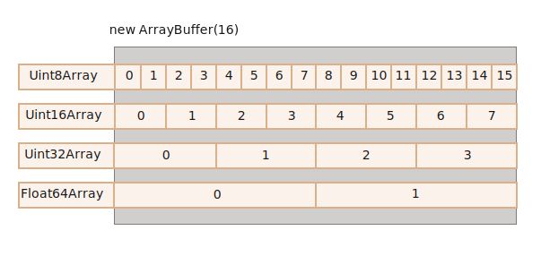
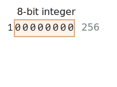
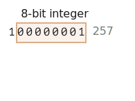
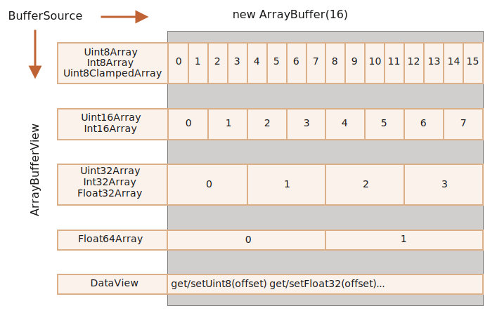
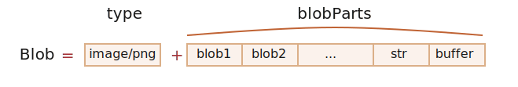

<link href="../styles.css" rel="stylesheet" />

# Работа с данными

- [Работа с JSON](#работа-с-json)
  - [Сериализация в JSON и десериализация](#сериализация-в-json-и-десериализация)
- [Работа с XML](#работа-с-xml)
  - [Преобразование из строки в XML](#преобразование-из-строки-в-xml)
  - [Сериализация xml-документа в строку](#сериализация-xml-документа-в-строку)
- [Бинарные данные](#бинарные-данные)
  - [ArrayBuffer, бинарные массивы](#arraybuffer-бинарные-массивы)
    - [TypedArray](#typedarray)
      - [Что будет, если выйти за пределы допустимых значений?](#что-будет-если-выйти-за-пределы-допустимых-значений)
    - [Методы TypedArray](#методы-typedarray)
    - [DataView](#dataview)
    - [Итого](#итого)
    - [Задачи](#задачи)
      - [Соедините типизированные массивы](#соедините-типизированные-массивы)
  - [TextDecoder и TextEncoder](#textdecoder-и-textencoder)
    - [TextEncoder](#textencoder)
  - [Blob](#blob)
    - [Blob как URL](#blob-как-url)
    - [Blob to base64](#blob-to-base64)
    - [Изображение в Blob](#изображение-в-blob)
- [Куки](#куки)
  - [Установка параметров куки](#установка-параметров-куки)
    - [Параметр expires](#параметр-expires)
    - [Путь и домен](#путь-и-домен)
    - [Параметр secure](#параметр-secure)
  - [Получение куки](#получение-куки)
  - [Ограничения куки](#ограничения-куки)
- [Web Storage](#web-storage)
  - [Сохранение данных](#сохранение-данных)
  - [Получение данных](#получение-данных)
  - [Удаление](#удаление)
- [Источники информации](#источники-информации)

## Работа с JSON
*[JSON]: JavaScript Object Notation

<dfn title="JSON">JSON</dfn> (JavaScript Object Notation) представляет легковесный формат хранения данных. JSON описывает структуру и организацию данных JavaScript. Простота JSON привела к тому, что в настоящий момент он является наиболее популярным форматом передачи данных в среде web, вытеснив другой некогда популярный формат xml.

Объекты JSON очень похожи на объекты JavaScript, тем более что JSON является подмножеством JavaScript. В то же время важно их различать: JavaScript является языком программирования, а JSON является форматом данных.

JSON поддерживает три типа данных: примитивные значения, объекты и массивы. Примитивные значения представляют стандартные строки, числа, значение `null`, логические значения `true` и `false`.[^11.1]

Объекты представляют набор простейших данных, других объектов и массивов. Например, типичный объект JSON:
```json
{
    "name": "Tom",
    "married": true,
    "age": 30
}
```

В javascript этому объекту соответствовал бы следующий:
```js
const user = {
    name: "Tom",
    married: true,
    age: 30
}
```

Несмотря на общее сходство, в то же время есть и различия: в JSON названия свойств заключаются в двойные кавычки, как обычные строки. Кроме того, объекты JSON не могут хранить функции, переменные, как объекты javascript.

Объекты могут быть сложными:
```json
{
    "name": "Tom",
    "married": true,
    "age": 30,
    "company": {
        "name": "Microsoft",
        "address": "USA, Redmond"
    }
}
```

Массивы в JSON похожи на массивы javascript и также могут хранить простейшие данные или объекты:
```json
["Tom", true, 30]
```

Массив объектов:
```json
[{
    "name": "Tom",
    "married": true,
    "age": 30
},{
    "name": "Alice",
    "married": false,
    "age": 23
}]
```

### Сериализация в JSON и десериализация
Для работы с форматом JSON в языке JavaScript предназначен **`JSON`**. Он позволяет преобразовать объект JavaScript в формат json и наоборот.

Для сериализации объекта javascript в json применяется функция **`JSON.stringify()`**:
```js
// объект javascript
const user = {
    name: "Tom",
    married: false,
    age: 39
};
// объект json
const serializedUser = JSON.stringify(user);
console.log(serializedUser); // {"name":"Tom","married":false,"age":39}
```

Для обратной операции — десериализации или парсинга json-объекта в javascript применяется метод **`JSON.parse()`**:
```js
const user = {
    name: "Tom",
    married: false,
    age: 39
};
// сериализация
const serializedUser = JSON.stringify(user);
// десериализация
const tomUser = JSON.parse(serializedUser);
console.log(tomUser.name); // Tom
```

## Работа с XML
Одним из популярных форматов описания данных является формат XML. И язык JavaScript предоставляет инструментарий для работы с XML.[^11.2]

### Преобразование из строки в XML
Для создания XML-объектов на основе строки, которая содержит данные в формате XML, применяется объект **`DOMParser`**. Его методу **`parseFormString()`** можно передать соответствующую строку в качестве первого аргумента и тип MIME (обычно `text/xml`) в качестве второго аргумента. Если переданная строка содержит корректный код XML, то метод возвратит объект типа **`Document`**, который будет содержать разобранный XML. А чтобы выбрать конкретные данные из полученного документа XML, можно применять стандартные методы выбора элементов DOM, например, **`querySelector()`**.

Например, рассмотрим следующую программу:
```js
const xmlString = `<?xml version="1.0" encoding="UTF-8" ?>
    <users>
        <user name="Tom" age="39">
            <company>
                <title>Microsoft</title>
            </company>
        </user>
        <user name="Bob" age="43">
            <company>
                <title>Google</title>
            </company>
        </user>
    </users>`;

const domParser = new DOMParser();
const xmlDOM = domParser.parseFromString(xmlString, "text/xml");
// обратимся к первому элементу user
const firstUser = xmlDOM.querySelector("user");
console.log(firstUser.getAttribute("name"));                    // Tom
console.log(firstUser.getAttribute("age"));                     // 39
console.log(firstUser.querySelector("title").textContent);      // Microsoft
```

Здесь xml-документ задан строкой xmlString. Но пока это именно строка, а не xml-документ. И для парсинга строки в xml-документ создаем объект **`DOMParser`** и выполняем его метод `parseFormString()`, в который передается наша строка:
```js
const domParser = new DOMParser();
const xmlDOM = domParser.parseFromString(xmlString, "text/xml");
```

Получив xml-документ, выбираем первый элемент user с помощью метода `querySelector`
```js
const firstUser = xmlDOM.querySelector("user");
```

Далее мы можем обращаться к содержимому элемента user - к его вложенным элементам и атриубтам
```js
console.log(firstUser.getAttribute("name"));                    // Tom
console.log(firstUser.getAttribute("age"));                     // 39
console.log(firstUser.querySelector("title").textContent);      // Microsoft
```

### Сериализация xml-документа в строку
Для обратного преобразования — из xml-документа в строку — применяется объект **`XMLSerializer`**. Этот объект предоставляет метод **`serializeToString()`**, который получает объект XML и возвращает объект XML в форме строки. Например:
```js
const xmlString = `<?xml version="1.0" encoding="UTF-8" ?>
    <users>
        <user name="Tom" age="39">
            <company>
                <title>Microsoft</title>
            </company>
        </user>
        <user name="Bob" age="43">
            <company>
                <title>Google</title>
            </company>
        </user>
    </users>`;

// преобразуем строку в XML
const domParser = new DOMParser();
const xmlDOM = domParser.parseFromString(xmlString, "text/xml");
// преобразуем обратно из XML в строку
const xmlSerializer = new XMLSerializer();
const xmlString2 = xmlSerializer.serializeToString(xmlDOM);
console.log(xmlString2);
```

В итоге мы получим обратно изначальную строку `xmlString`.

Поскольку документ html по сути также является документом xml, то мы можем сериализовать в строку и html-страницу или ее часть. Например, преобразуем в строку текущую веб-страницу:
```js
const xmlSerializer = new XMLSerializer();
const htmlString = xmlSerializer.serializeToString(document);
console.log(htmlString);
```

## Бинарные данные

### ArrayBuffer, бинарные массивы
В сфере веб-разработки мы встречаемся с бинарными данными чаще всего тогда, когда требуется выполнить какие-то действия над файлами (создать, загрузить или скачать). Другим типичным примером такой встречи является обработка изображений.

Всё это возможно осуществить на JavaScript. Более того, операции над бинарными данными являются высокопроизводительными.[^arraybuffer-binary-arrays]

Обилие классов для работы с бинарными данными может немного запутать. Вот некоторые из них:

- `ArrayBuffer`, `Uint8Array`, `DataView`, `Blob`, `File` и т.д.

Работа с бинарными данными в JavaScript реализована нестандартно по сравнению с другими языками программирования. Но когда мы в этом разберёмся, то всё окажется весьма просто.

**Базовый объект для работы с бинарными данными имеет тип `ArrayBuffer` и представляет собой ссылку на непрерывную область памяти фиксированной длины.**

Вот так мы можем создать его экземпляр:
```js
let buffer = new ArrayBuffer(16); // создаётся буфер длиной 16 байт
alert(buffer.byteLength); // 16
```

Инструкция выше выделяет непрерывную область памяти размером 16 байт и заполняет её нулями.

!!! warning "ArrayBuffer – это не массив!"
    Давайте внесём ясность, чтобы не запутаться. `ArrayBuffer` не имеет ничего общего с `Array`:

    - его длина фиксирована, мы не можем увеличивать или уменьшать её.
    - `ArrayBuffer` занимает ровно столько места в памяти, сколько указывается при создании.
    - Для доступа к отдельным байтам нужен вспомогательный объект-представление, `buffer[index]` не сработает.

`ArrayBuffer` – это область памяти. Что там хранится? Этой информации нет. Просто необработанный («сырой») массив байтов.

**Для работы с `ArrayBuffer` нам нужен специальный объект, реализующий «представление» данных.**

Такие объекты не хранят какое-то собственное содержимое. Они интерпретируют бинарные данные, хранящиеся в `ArrayBuffer`.

Например:

- **`Uint8Array`** – представляет каждый байт в `ArrayBuffer` как отдельное число; возможные значения находятся в промежутке от 0 до 255 (в байте 8 бит, отсюда такой набор). Такое значение называется «8-битное целое без знака».
- **`Uint16Array`** – представляет каждые 2 байта в `ArrayBuffer` как целое число; возможные значения находятся в промежутке от 0 до 65535. Такое значение называется «16-битное целое без знака».
- **`Uint32Array`** – представляет каждые 4 байта в `ArrayBuffer` как целое число; возможные значения находятся в промежутке от 0 до 4294967295. Такое значение называется «32-битное целое без знака».
- **`Float64Array`** – представляет каждые 8 байт в `ArrayBuffer` как число с плавающей точкой; возможные значения находятся в промежутке между 5.0x10^-324^ и 1.8x10^308^.

Таким образом, бинарные данные из `ArrayBuffer` размером 16 байт могут быть представлены как 16 чисел маленькой разрядности или как 8 чисел большей разрядности (по 2 байта каждое), или как 4 числа ещё большей разрядности (по 4 байта каждое), или как 2 числа с плавающей точкой высокой точности (по 8 байт каждое).

<figure>



</figure>

`ArrayBuffer` – это корневой объект, основа всего, необработанные бинарные данные.

Но если мы собираемся что-то записать в него или пройтись по его содержимому, да и вообще для любых действий мы должны использовать какой-то объект-представление («view»), например:
```js
let buffer = new ArrayBuffer(16); // создаётся буфер длиной 16 байт

let view = new Uint32Array(buffer); // интерпретируем содержимое как последовательность 32-битных целых чисел без знака

alert(Uint32Array.BYTES_PER_ELEMENT); // 4 байта на каждое целое число

alert(view.length); // 4, именно столько чисел сейчас хранится в буфере
alert(view.byteLength); // 16, размер содержимого в байтах

// давайте запишем какое-нибудь значение
view[0] = 123456;

// теперь пройдёмся по всем значениям
for(let num of view) {
  alert(num); // 123456, потом 0, 0, 0 (всего 4 значения)
}
```

#### TypedArray
Общий термин для всех таких представлений (`Uint8Array`, `Uint32Array` и т.д.) – это [`TypedArray`](https://tc39.github.io/ecma262/#sec-typedarray-objects), типизированный массив. У них имеется набор одинаковых свойств и методов.

Они уже намного больше напоминают обычные массивы: элементы проиндексированы, и возможно осуществить обход содержимого.

Конструкторы типизированных массивов (будь то `Int8Array` или `Float64Array`, без разницы) ведут себя по-разному в зависимости от типа передаваемого им аргумента.

Есть 5 вариантов создания типизированных массивов:
```js
new TypedArray(buffer, [byteOffset], [length]);
new TypedArray(object);
new TypedArray(typedArray);
new TypedArray(length);
new TypedArray();
```

1. Если передан аргумент типа `ArrayBuffer`, то создаётся объект-представление для него. Мы уже использовали этот синтаксис ранее.

    Дополнительно можно указать аргументы `byteOffset` (0 по умолчанию) и `length` (до конца буфера по умолчанию), тогда представление будет покрывать только часть данных в `buffer`.

2. Если в качестве аргумента передан `Array` или какой-нибудь псевдомассив, то будет создан типизированный массив такой же длины и с тем же содержимым.

    Мы можем использовать эту возможность, чтобы заполнить типизированный массив начальными данными:
    ```js
    let arr = new Uint8Array([0, 1, 2, 3]);
    alert( arr.length ); // 4, создан бинарный массив той же длины
    alert( arr[1] ); // 1, заполнен 4-мя байтами с указанными значениями
    ```

3. Если в конструктор передан другой объект типа `TypedArray`, то делается то же самое: создаётся типизированный массив с такой же длиной и в него копируется содержимое. При необходимости значения будут приведены к новому типу.

    ```js
    let arr16 = new Uint16Array([1, 1000]);
    let arr8 = new Uint8Array(arr16);
    alert( arr8[0] ); // 1
    alert( arr8[1] ); // 232, потому что 1000 не помещается в 8 бит (разъяснения будут ниже)
    ```

4. Если передано число `length` – будет создан типизированный массив, содержащий именно столько элементов. Размер нового массива в байтах будет равен числу элементов `length`, умноженному на размер одного элемента `TypedArray.BYTES_PER_ELEMENT`:

    ```js
    let arr = new Uint16Array(4); // создаём типизированный массив для 4 целых 16-битных чисел без знака
    alert( Uint16Array.BYTES_PER_ELEMENT ); // 2 байта на число
    alert( arr.byteLength ); // 8 (размер массива в байтах)
    ```

5. При вызове без аргументов будет создан пустой типизированный массив.

Как видим, можно создавать типизированные массивы `TypedArray` напрямую, не передавая в конструктор объект типа `ArrayBuffer`. Но представления не могут существовать сами по себе без двоичных данных, так что на самом деле объект `ArrayBuffer` создаётся автоматически во всех случаях, кроме первого, когда он явно передан в конструктор представления.

Для доступа к `ArrayBuffer` в `TypedArray` есть следующие свойства:

- `buffer` – ссылка на объект `ArrayBuffer`.
- `byteLength` – размер содержимого `ArrayBuffer` в байтах.

Таким образом, мы всегда можем перейти от одного представления к другому:
```js
let arr8 = new Uint8Array([0, 1, 2, 3]);

// другое представление на тех же данных
let arr16 = new Uint16Array(arr8.buffer);
```

Список типизированных массивов:

- `Uint8Array`, `Uint16Array`, `Uint32Array` – целые беззнаковые числа по 8, 16 и 32 бита соответственно.
  - `Uint8ClampedArray` – 8-битные беззнаковые целые, обрезаются по верхней и нижней границе при присвоении (об этом ниже).
- `Int8Array`, `Int16Array`, `Int32Array` – целые числа со знаком (могут быть отрицательными).
- `Float32Array`, `Float64Array` – 32- и 64-битные числа со знаком и плавающей точкой.

!!! warning "Не существует примитивных типов данных int8 и т.д."
    Обратите внимание: несмотря на названия вроде `Int8Array`, в JavaScript нет примитивных типов данных `int` или `int8`.

    Это логично, потому что `Int8Array` – это не массив отдельных значений, а представление, основанное на бинарных данных из объекта типа `ArrayBuffer`.

##### Что будет, если выйти за пределы допустимых значений?
Что если мы попытаемся записать в типизированный массив значение, которое превышает допустимое для данного массива? Ошибки не будет. Лишние биты просто будут отброшены.

Например, давайте попытаемся записать число 256 в объект типа `Uint8Array`. В двоичном формате 256 представляется как `100000000` (9 бит), но `Uint8Array` предоставляет только 8 бит для значений. Это определяет диапазон допустимых значений от 0 до 255.

Если наше число больше, то только 8 младших битов (самые правые) будут записаны, а лишние отбросятся:

<figure>



</figure>

Таким образом, вместо 256 запишется 0.

Число 257 в двоичном формате выглядит как `100000001` (9 бит), но принимаются во внимание только 8 самых правых битов, так что в объект будет записана единичка:

<figure>



</figure>

Другими словами, записываются только значения по модулю 2^8^.

Вот демо:
```js
let uint8array = new Uint8Array(16);

let num = 256;
alert(num.toString(2)); // 100000000 (в двоичном формате)

uint8array[0] = 256;
uint8array[1] = 257;

alert(uint8array[0]); // 0
alert(uint8array[1]); // 1
```

`Uint8ClampedArray`, упомянутый ранее, ведёт себя по-другому в данных обстоятельствах. В него записываются значения 255 для чисел, которые больше 255, и 0 для отрицательных чисел. Такое поведение полезно в некоторых ситуациях, например при обработке изображений.

#### Методы TypedArray
Типизированные массивы `TypedArray`, за некоторыми заметными исключениями, имеют те же методы, что и массивы `Array`.

Мы можем обходить их, вызывать `map`, `slice`, `find`, `reduce` и т.д.

Однако, есть некоторые вещи, которые нельзя осуществить:

- Нет метода `splice` – мы не можем удалять значения, потому что типизированные массивы – это всего лишь представления данных из буфера, а буфер – это непрерывная область памяти фиксированной длины. Мы можем только записать 0 вместо значения.
- Нет метода `concat`.

Но зато есть два дополнительных метода:

- `arr.set(fromArr, [offset])` копирует все элементы из `fromArr` в `arr`, начиная с позиции `offset` (0 по умолчанию).
- `arr.subarray([begin, end])` создаёт новое представление того же типа для данных, начиная с позиции `begin` до `end` (не включая). Это похоже на метод `slice` (который также поддерживается), но при этом ничего не копируется – просто создаётся новое представление, чтобы совершать какие-то операции над указанными данными.

Эти методы позволяют нам копировать типизированные массивы, смешивать их, создавать новые на основе существующих и т.д.

#### DataView
[`DataView`](https://developer.mozilla.org/en-US/docs/Web/JavaScript/Reference/Global_Objects/DataView) – это специальное супергибкое нетипизированное представление данных из `ArrayBuffer`. Оно позволяет обращаться к данным на любой позиции и в любом формате.

- В случае типизированных массивов конструктор строго задаёт формат данных. Весь массив состоит из однотипных значений. Доступ к i-ому элементу можно получить как `arr[i]`.
- В случае `DataView` доступ к данным осуществляется посредством методов типа `.getUint8(i)` или `.getUint16(i)`. Мы выбираем формат данных в момент обращения к ним, а не в момент их создания.

Синтаксис:
```js
new DataView(buffer, [byteOffset], [byteLength])
```

- **`buffer`** – ссылка на бинарные данные `ArrayBuffer`. В отличие от типизированных массивов, `DataView` не создаёт буфер автоматически. Нам нужно заранее подготовить его самим.
- **`byteOffset`** – начальная позиция данных для представления (по умолчанию 0).
- **`byteLength`** – длина данных (в байтах), используемых в представлении (по умолчанию – до конца `buffer`).

Например, извлечём числа в разных форматах из одного и того же буфера двоичных данных:
```js
// бинарный массив из 4х байт, каждый имеет максимальное значение 255
let buffer = new Uint8Array([255, 255, 255, 255]).buffer;

let dataView = new DataView(buffer);

// получим 8-битное число на позиции 0
alert( dataView.getUint8(0) ); // 255

// а сейчас мы получим 16-битное число на той же позиции 0, оно состоит из 2-х байт, вместе составляющих число 65535
alert( dataView.getUint16(0) ); // 65535 (максимальное 16-битное беззнаковое целое)

// получим 32-битное число на позиции 0
alert( dataView.getUint32(0) ); // 4294967295 (максимальное 32-битное беззнаковое целое)

dataView.setUint32(0, 0); // при установке 4-байтового числа в 0, во все его 4 байта будут записаны нули
```

Представление `DataView` отлично подходит, когда мы храним данные разного формата в одном буфере. Например, мы храним последовательность пар, первое значение пары 16-битное целое, а второе – 32-битное с плавающей точкой. `DataView` позволяет легко получить доступ к обоим.

#### Итого
`ArrayBuffer` – это корневой объект, ссылка на непрерывную область памяти фиксированной длины.

Чтобы работать с объектами типа `ArrayBuffer`, нам нужно представление («view»).

- Это может быть типизированный массив `TypedArray`:
  - `Uint8Array`, `Uint16Array`, `Uint32Array` – для беззнаковых целых по 8, 16 и 32 бита соответственно.
  - `Uint8ClampedArray` – для 8-битных беззнаковых целых, которые обрезаются по верхней и нижней границе при присвоении.
  - `Int8Array`, `Int16Array`, `Int32Array` – для знаковых целых чисел (могут быть отрицательными).
  - `Float32Array`, `Float64Array` – для 32- и 64-битных знаковых чисел с плавающей точкой.
- Или `DataView` – представление, использующее отдельные методы, чтобы уточнить формат данных при обращении, например, `getUint8(offset)`.

Обычно мы создаём и работаем с типизированными массивами, оставляя `ArrayBuffer` «под капотом». Но мы можем в любой момент получить к нему доступ с помощью .`buffer` и при необходимости создать другое представление.

Существуют ещё 2 дополнительных термина, которые используются в описаниях методов, работающих с бинарными данными:

- `ArrayBufferView` – это общее название для представлений всех типов.
- `BufferSource` – это общее название для `ArrayBuffer` или `ArrayBufferView`.
Мы встретимся с ними в следующих разделах. `BufferSource` встречается очень часто и означает «бинарные данные в любом виде» – `ArrayBuffer` или его представление.

Вот шпаргалка:



#### Задачи

##### Соедините типизированные массивы
Дан массив из типизированных массивов `Uint8Array`. Напишите функцию `concat(arrays)`, которая объединяет эти массивы в один типизированный массив и возвращает его.

<details>
<summary>Решение</summary>

```js
function concat(arrays) {
  // находим общую длину переданных массивов
  let totalLength = arrays.reduce((acc, value) => acc + value.length, 0);

  let result = new Uint8Array(totalLength);

  if (!arrays.length) return result;

  // копируем каждый из массивов в result
  // следующий массив копируется сразу после предыдущего
  let offset = 0;
  for(let array of arrays) {
    result.set(array, offset);
    offset += array.length;
  }

  return result;
}
```

[Код решения](../src/16_data/array_buffer/index.html)

[Тесты](../src/16_data/array_buffer/test.js)

</details>

### TextDecoder и TextEncoder
Что если бинарные данные фактически являются строкой? Например, мы получили файл с текстовыми данными.

Встроенный объект [`TextDecoder`](https://encoding.spec.whatwg.org/#interface-textdecoder) позволяет декодировать данные из бинарного буфера в обычную строку.[^text-decoder]

Для этого прежде всего нам нужно создать сам декодер:
```js
let decoder = new TextDecoder([label], [options]);
```

- **`label`** – тип кодировки, utf-8 используется по умолчанию, но также поддерживаются big5, windows-1251 и многие другие.
- **`options`** – объект с дополнительными настройками:
  - `fatal` – `boolean`, если значение `true`, тогда генерируется ошибка для невалидных (не декодируемых) символов, в ином случае (по умолчанию) они заменяются символом `\uFFFD`.
  - `ignoreBOM` – `boolean`, если значение `true`, тогда игнорируется BOM (дополнительный признак, определяющий порядок следования байтов), что необходимо крайне редко.

…и после использовать его метод `decode`:
```js
let str = decoder.decode([input], [options]);
```

- **`input`** – бинарный буфер (`BufferSource`) для декодирования.
- **`options`** – объект с дополнительными настройками:
  - `stream` – `true` для декодирования потока данных, при этом `decoder` вызывается вновь и вновь для каждого следующего фрагмента данных. В этом случае многобайтовый символ может иногда быть разделён и попасть в разные фрагменты данных. Это опция указывает `TextDecoder` запомнить символ, на котором остановился процесс, и декодировать его со следующим фрагментом.

Например:
```js
let uint8Array = new Uint8Array([72, 101, 108, 108, 111]);

alert( new TextDecoder().decode(uint8Array) ); // Hello
```

```js
let uint8Array = new Uint8Array([228, 189, 160, 229, 165, 189]);

alert( new TextDecoder().decode(uint8Array) ); // 你好
```

Мы можем декодировать часть бинарного массива, создав подмассив:
```js
let uint8Array = new Uint8Array([0, 72, 101, 108, 108, 111, 0]);

// Возьмём строку из середины массива
// Также обратите внимание, что это создаёт только новое представление без копирования самого массива.
// Изменения в содержимом созданного подмассива повлияют на исходный массив и наоборот.
let binaryString = uint8Array.subarray(1, -1);

alert( new TextDecoder().decode(binaryString) ); // Hello
```

#### TextEncoder
[`TextEncoder`](https://encoding.spec.whatwg.org/#interface-textencoder) поступает наоборот – кодирует строку в бинарный массив.

Имеет следующий синтаксис:
```js
let encoder = new TextEncoder();
```

Поддерживается только кодировка «utf-8».

Кодировщик имеет следующие два метода:

- **`encode(str)`** – возвращает бинарный массив `Uint8Array`, содержащий закодированную строку.
- **`encodeInto(str, destination)`** – кодирует строку (`str`) и помещает её в `destination`, который должен быть экземпляром `Uint8Array`.

```js
let encoder = new TextEncoder();

let uint8Array = encoder.encode("Hello");
alert(uint8Array); // 72,101,108,108,111
```

### Blob
`ArrayBuffer` и бинарные массивы являются частью ECMA-стандарта и, соответственно, частью JavaScript.

Кроме того, в браузере имеются дополнительные высокоуровневые объекты, описанные в [File API](https://www.w3.org/TR/FileAPI/).

Объект `Blob` состоит из необязательной строки `type` (обычно MIME-тип) и `blobParts` – последовательности других объектов `Blob`, строк и `BufferSource`.[^blob]

<figure>



</figure>

Благодаря `type` мы можем загружать и скачивать Blob-объекты, где `type` естественно становится `Content-Type` в сетевых запросах.

Конструктор имеет следующий синтаксис:
```js
new Blob(blobParts, options);
```

- `blobParts` – массив значений `Blob`/`BufferSource`/`String`.
- `options` – необязательный объект с дополнительными настройками:
  - `type` – тип объекта, обычно MIME-тип, например. `image/png`,
  - `endings` – если указан, то окончания строк создаваемого `Blob` будут изменены в соответствии с текущей операционной системой (`\r\n` или `\n`). По умолчанию `"transparent"` (ничего не делать), но также может быть `"native"` (изменять).

Например:
```js
// создадим Blob из строки
let blob = new Blob(["<html>…</html>"], {type: 'text/html'});
// обратите внимание: первый аргумент должен быть массивом [...]
```

```js
// создадим Blob из типизированного массива и строк
let hello = new Uint8Array([72, 101, 108, 108, 111]); // "hello" в бинарной форме

let blob = new Blob([hello, ' ', 'world'], {type: 'text/plain'});
```

Мы можем получить срез `Blob`, используя:
```js
blob.slice([byteStart], [byteEnd], [contentType]);
```

- **`byteStart`** – стартовая позиция байта, по умолчанию 0.
- **`byteEnd`** – последний байт, по умолчанию до конца.
- **`contentType`** – тип `type` создаваемого Blob-объекта, по умолчанию такой же, как и исходный.

Аргументы – как в `array.slice`, отрицательные числа также разрешены.

!!! info "Blob не изменяем (immutable)"
    Мы не можем изменять данные напрямую в `Blob`, но мы можем делать срезы и создавать новый `Blob` на их основе, объединять несколько объектов в новый и так далее.

    Это поведение аналогично JavaScript-строке: мы не можем изменить символы в строке, но мы можем создать новую исправленную строку на базе имеющейся.

#### Blob как URL
`Blob` может быть использован как URL для `<a>`, `` или других тегов, для показа содержимого.

Давайте начнём с простого примера. При клике на ссылку мы загружаем динамически генерируемый `Blob` с `hello world` содержимым как файл:
```html
<!-- download атрибут указывает браузеру делать загрузку вместо навигации -->
<a download="hello.txt" href='#' id="link">Загрузить</a>

<script>
let blob = new Blob(["Hello, world!"], {type: 'text/plain'});

link.href = URL.createObjectURL(blob);
</script>
```

Мы также можем создать ссылку динамически, используя только JavaScript, и эмулировать на ней клик, используя `link.click()`, тогда загрузка начнётся автоматически.

Далее простой пример создания «на лету» и загрузки `Blob`-объекта, без использования HTML:
```js
let link = document.createElement('a');
link.download = 'hello.txt';

let blob = new Blob(['Hello, world!'], {type: 'text/plain'});

link.href = URL.createObjectURL(blob);

link.click();

URL.revokeObjectURL(link.href);
```

**`URL.createObjectURL` берёт `Blob` и создаёт уникальный URL для него в формате `blob:<origin>/<uuid>`.**

Вот как выглядит сгенерированный URL:
```
blob:https://javascript.info/1e67e00e-860d-40a5-89ae-6ab0cbee6273
```

Браузер для каждого URL, сгенерированного через `URL.createObjectURL`, сохраняет внутреннее соответствие URL → `Blob`. Таким образом, такие URL короткие, но дают доступ к большому объекту `Blob`.

Сгенерированный `url` действителен, только пока текущий документ открыт. Это позволяет ссылаться на сгенерированный в нём `Blob` в ``, `<a>` или в любом другом объекте, где ожидается url в качестве одного из параметров.

В данном случае возможен побочный эффект. Пока в карте соответствия существует ссылка на `Blob`, он находится в памяти. Браузер не может освободить память, занятую `Blob`-объектом.

Ссылка в карте соответствия автоматически удаляется при выгрузке документа, после этого также освобождается память. Но если приложение имеет длительный жизненный цикл, это может произойти не скоро. Таким образом, если мы создадим URL для `Blob`, он будет висеть в памяти, даже если в нём нет больше необходимости.

**`URL.revokeObjectURL(url)` удаляет внутреннюю ссылку на объект, что позволяет удалить его (если нет другой ссылки) сборщику мусора, и память будет освобождена.**

В последнем примере мы использовали `Blob` только единожды, для мгновенной загрузки, после мы сразу же вызвали `URL.revokeObjectURL(link.href)`.

В предыдущем примере с кликабельной HTML-ссылкой мы не вызывали URL.`revokeObjectURL(link.href)`, потому что это сделало бы ссылку недействительной. После удаления внутренней ссылки на `Blob`, URL больше не будет работать.

#### Blob to base64
Альтернатива `URL.createObjectURL` – конвертация `Blob`-объекта в строку с кодировкой base64.

Эта кодировка представляет двоичные данные в виде строки с безопасными для чтения символами в ASCII-кодах от 0 до 64. И что более важно – мы можем использовать эту кодировку для «data-urls».

[data url](https://developer.mozilla.org/ru/docs/Web/HTTP/Basics_of_HTTP/Data_URIs) имеет форму `data:[<mediatype>][;base64],<data>`. Мы можем использовать такой url где угодно наряду с «обычным» url.

Например, смайлик:
```html

```

Браузер декодирует строку и показывает смайлик: 

Для трансформации `Blob` в base64 мы будем использовать встроенный в браузер объект типа `FileReader`. Он может читать данные из `Blob` в множестве форматов. Далее он рассмотривается более подробно.

Вот пример загрузки `Blob` при помощи `base64`:
```js
let link = document.createElement('a');
link.download = 'hello.txt';

let blob = new Blob(['Hello, world!'], {type: 'text/plain'});

let reader = new FileReader();
reader.readAsDataURL(blob); // конвертирует Blob в base64 и вызывает onload

reader.onload = function() {
  link.href = reader.result; // url с данными
  link.click();
};
```

Оба варианта могут быть использованы для создания URL с `Blob`. Но обычно URL.`createObjectURL(blob)` является более быстрым и безопасным.

URL.createObjectURL(blob) | Blob to data url
-- | --
• Нужно отзывать объект для освобождения памяти.<br>• Прямой доступ к `Blob`, без «кодирования/декодирования». | • Нет необходимости что-либо отзывать.<br>• Потеря производительности и памяти при декодировании больших Blob-объектов.

#### Изображение в Blob
Мы можем создать `Blob` для изображения, части изображения или даже создать скриншот страницы. Что удобно для последующей загрузки куда-либо.

Операции с изображениями выполняются через элемент `<canvas>`:

1. Для отрисовки изображения (или его части) на холсте (*canvas*) используется [`canvas.drawImage`](https://developer.mozilla.org/ru/docs/Web/API/CanvasRenderingContext2D/drawImage).
2. Вызов `canvas`-метода [`.toBlob(callback, format, quality)`](https://developer.mozilla.org/ru/docs/Web/API/HTMLCanvasElement/toBlob) создаёт `Blob` и вызывает функцию `callback` при завершении.

В примере ниже изображение просто копируется, но мы можем взять его часть или трансформировать его на canvas перед созданием `Blob`:
```js
// берём любое изображение
let img = document.querySelector('img');

// создаём <canvas> того же размера
let canvas = document.createElement('canvas');
canvas.width = img.clientWidth;
canvas.height = img.clientHeight;

let context = canvas.getContext('2d');

// копируем изображение в  canvas (метод позволяет вырезать часть изображения)
context.drawImage(img, 0, 0);
// мы можем вращать изображение при помощи context.rotate() и делать множество других преобразований

// toBlob является асинхронной операцией, для которой callback-функция вызывается при завершении
canvas.toBlob(function(blob) {
  // после того, как Blob создан, загружаем его
  let link = document.createElement('a');
  link.download = 'example.png';

  link.href = URL.createObjectURL(blob);
  link.click();

  // удаляем внутреннюю ссылку на Blob, что позволит браузеру очистить память
  URL.revokeObjectURL(link.href);
}, 'image/png');
```

Или если вы предпочитаете `async`/`await` вместо колбэка:
```js
let blob = await new Promise(resolve => canvasElem.toBlob(resolve, 'image/png'));
```

Для создания скриншота страницы мы можем использовать такую библиотеку, как https://github.com/niklasvh/html2canvas. Всё, что она делает, это просто проходит страницу и отрисовывает её в `<canvas>`. После этого мы может получить `Blob` одним из вышеуказанных способов.

## Куки
Одну из возможностей сохранения данных в браузере представляет использование куки. Так, каждый раз, когда мы обращаемся к веб-странице в интернете, то веб-сервер вместо с этой страницей присылает связаные с этой страницей куки (при их наличии). И браузер хранит эти данные некоторое время. При последующих обращениях к той же странице или сайту в зависимости от настроек куки обратно посылаются из браузера на сервер.

Для работы с куками в языке JavaScript в объекте **`document`** предназначено свойство **`cookie`**.

Для установки куки достаточно свойству `document.cookie` присвоить строку с куками:
```html
<!DOCTYPE html>
<html>
<head>
    <meta charset="utf-8" />
    <title>Example</title>
</head>
<body>
    <script>
        document.cookie = "login=tom32;";
        console.log(document.cookie);
    </script>
</body>
</html>
```

В данном случае устанавливается куки, которая называется "login" и которая имеет значение "tom32". Затем получаем куки и выводим их на консоль.

Но стоит отметить, что работа с куками может различаться в зависимости от того, какой браузер используется, и как запускается веб-страница: как локальный файл или как файл на веб-сервере. Например, если мы запустим веб-страницу как локальный файл, то есть просто бросим выше определенную веб-страницу в браузер Mozilla FireFox или Safari, то браузер установит куки и выведет их на консоль. Браузеры поддерживают просмотр установленных кук (как и других сохраненных данных). Например, если брать Mozilla FireFox, то в инструментах разработчика есть вкладки "Хранилище" (в русскоязычной локализации), и там можно посмотреть куки:


Однако в других браузерах, например, в Google Chrome или Opera на установку куки в веб-страницах, которые представляют локальные файлы, действуют ограничения. Соответственно, если мы бросим выше определенную страницу в Google Chrome, то консоль нам ничего не отобразит. Потому что Google Chrome по умолчанию поддерживает установку кук только в веб-страницах, которые загружаются с веб-сервера и принадлежат некоторому домену в сети. Что в принципе неудивительно. Ведь куки предназначены прежде всего для пересылки данных по протоколу http от клиента серверу и обратно.

Поэтому в дальнейшем для работы с куками мы располагать html-страницы на веб-сервере. В данном случае воспользуемся самым простым вариантом — Node.js, так как эта технология двольно проста, доступна для всех основных операционных систем и также также позволяет использовать javascript для создания приложений. Но естественно перед созданием приложения необходимо [установить Node.js](https://metanit.com/web/nodejs/1.1.php). В данном случае не потребуется никаких знаний node.js, весь используемый код подробно описывается. Но опять же вместо node.js это может быть любая другая технология сервера — php, asp.net, python и т.д. либо какой-то определенный веб-сервер типа Apache или IIS.

Итак, создадим в файловой системе папку для файлов веб-сервера. Например, пусть это будет папка *C:\app*. Далее в этой папке определим файл сервера. Пусть он будет называться *server.js* и будет иметь следующий код:
```js
const http = require("http");
const fs = require("fs");

http.createServer(function(_, response){

    fs.readFile("index.html", (_, data) => response.end(data));

}).listen(3000, ()=>console.log("Сервер запущен по адресу http://localhost:3000"));
```

Это самый примитивный сервер, который достаточен для нашей задачи. Вкратце пробежимся по коду. Сначала подключаются пакеты с функциональностью, которую мы собираемся использовать:
```js
const http = require("http");   // для обработки входящих запросов
const fs = require("fs");       // для чтения с жесткого диска файла index.html
```

Для создания сервера применяется функция **`http.createServer()`**. В эту функцию передается функция-обработчик, которая вызывается каждый раз, когда к серверу приходит запрос. Эта функция имеет два параметра: `request` (содержит данные запроса) и `response` (управляет отправкой ответа). Первый параметр не используется, поэтому вместо него указан прочерк `_`.

В функции-обработчике отправляем файл *index.html*, который мы дальше определим:
```js
fs.readFile("index.html", (error, data) => response.end(data));
```

Для считывания файлов применяется встроенная функция **`fs.readFile()`**. Первый параметр функции — адрес файла (в данном случае предполагается, что файл *index.html* находится в одной папке с файлом сервера *server.js*). Второй параметр — функция, которая вызывается после считывания файла и получет его содержимое через свой второй параметр `data`. Затем считанное содежимое также может быть отпавлено с помощью функции `response.end(data)`.

В конце с помощью функции **`listen()`** запускаем веб-сервер на 3000 порту. То есть сервер будет запускаться по адресу http://localhost:3000/

И также в той же папке определим файл *index.html* со следующим кодом:
```html
<!DOCTYPE html>
<html>
<head>
    <meta charset="utf-8" />
    <title>Example</title>
</head>
<body>
    <script>
        document.cookie = "login=tom32;";
        console.log(document.cookie);
    </script>
</body>
</html>
```

[^12.1]

Здесь, как уже было рассмотрено выше, устанавливается куки `login`. Затем куки выводятся на консоль.

Теперь в консоли перейдем к папке сервера с помощью команды **`cd`** и запустим сервер с помощью команды **`node server.js`**
```
C:\app>node server.js
Сервер запущен по адресу http://localhost:3000
```

После запуска сервера мы можем перейти в браузере по адресу http://localhost:3000, нам отобразится страница *index.html*. С помощью инструментов браузера мы сможем посмотреть установленные куки. Так, в Google Chrome это вкладка **Application**, а в левой части пункт **Storage** -> **Cookies**:


### Установка параметров куки
Строка куки принимает до шести различных параметров:

- Имя и значение куки

    Имя не чувствительно к регистру, что означает, что, например, `login` и `Login` относятся к одному и тому же файлу cookie. В качестве значений разрешены только строки (а не, скажем, числа). Имя и значение — единственные обязательные компоненты. Указывать остальную информацию необязательно (если она не указана, используются значения по умолчанию).

- Срок окончания действия (параметр **`expires`**)

    Дата истечения срока действия, до которой файл cookie действителен. По истечении указанной здесь даты срок действия файла cookie истекает, файл cookie удаляется и больше не отправляется на сервер. Если при создании файла cookie не указана дата истечения срока действия, он удаляется по умолчанию при завершении сеанса браузера.

- Путь (параметр **`path`**) и домен (параметр **`domain`**)

    Используются для разграничения куки. Например, файл cookie с доменом `www.localhost.com` отправляется только с запросами к этому домену. Файл cookie с доменом `www.localhost.com` и путем `/home` отправляется только с запросами на `www.localhost.com/home`, но не на `www.localhost.com/about`.

- Параметр **`secure`**

    Флаг безопасности, который можно использовать, чтобы дополнительно указать, следует ли отправлять файлы cookie только при соединениях, использующих протокол Secure Sockets Layer (SSL), например, чтобы разрешить отправку по https. Если этот параметр установлен, куки могут быть посланы по адресу https://www.localhost.com, а при запросах по адресу посланы по адресу http://www.localhost.com такие куки НЕ посылаются.

Выше использовались только два параметра: имя куки и значение:
```js
document.cookie = "login=tom32;";
```

То есть в данном случае куки имеет имя `login` и значение `tom32`.

#### Параметр expires
Но подобная куки имеет очень ограниченный срок жизни: если явным образом не установить срок действия, то кука будет удалена с закрытием браузера. Подобная ситуация, возможно, идеальна для тех случаев, когда необходимо удалять всю информацию после завершения работы с веб-приложением и закрытия браузера. Однако данное поведение не всегда подходит.

И в этом случае нам надо установить параметр **`expires`**, то есть срок действия куков:
```js
document.cookie = "login=tom32;expires=Sun, 31 Dec 2023 23:59:00 GMT;";
```

То есть срок действия куки `login` истекает в понедельник 31 декабря 2023 года в 23:59. Формат параметра `expires` очень важен. Однако его можно сгенерировать программно. Для этого мы можем использовать метод **`toUTCString()`** объекта `Date`:
```js
const expire = new Date();
expire.setHours(expire.getHours() + 4);
document.cookie = "login=tom32;expires=" + expire.toUTCString() + ";";
```

В данном случае срок действия куки будет составлять 4 часа.

#### Путь и домен
Если вдруг нам надо установить куки для какого-то определенного пути на сайте, то мы можем использовать параметр **`path`**. Например, мы хотим установить куки только для пути http://localhost:3000/home:
```js
document.cookie = "login=tom32;expires=Sun, 31 Dec 2023 23:59:00 GMT;path=/home;";
```

В этом случае для других путей на сайте, например, http://localhost:3000/about, эти куки будут недоступны. Однако стоит отметить, что эта кука будет установлена, если мы обращаемся по пути http://localhost:3000/home.

Если на нашем сайте есть несколько доменов, и мы хотим установить куки непосредственно для определенного домена, тогда можно использовать параметр **`domain`**. Например, у нас на сайте есть поддомен *blog.mysite.com*:
```js
document.cookie = "login=tom32;expires=Sun, 31 Dec 2023 23:59:00 GMT;path=/;domain=blog.mysite.com;";
```

Параметр `path=/` указывает, что куки будут доступны для всех директорий и путей поддомена *blog.mysite.com*.

#### Параметр secure
Последний параметр — **`secure`** задает использование SSL (SecureSockets Layer) и подходит для сайтов, использующих протокол https. Если значение этого параметра равно `true`, то куки будут использоваться только при установке защищенного соединения ssl. По умолчанию данный параметр равен `false`.

```js
document.cookie = "login=tom32;expires=Sun, 31 Dec 2023 23:59:00 GMT;path=/;secure=true;";
```

### Получение куки
Для простейшего извлечения куки из браузера достаточно обратиться к свойству **`document.cookie`**:
```js
const expire = new Date();
expire.setHours(expire.getHours() + 4);

document.cookie = "language=JavaScript;expires="+expire.toUTCString()+";";
document.cookie = "company=Localhost;expires="+expire.toUTCString()+";";
document.cookie = "login=tom32;";

console.log(document.cookie);
```

Здесь были установлены три куки, и консоль браузера выведет нам все эти куки:
```
language=JavaScript; company=Localhost; login=tom32
```

Извлеченные куки не включают параметры `expires`, `path`, `domain` и `secure`. Кроме того, сами куки разделяются точкой с запятой, поэтому нужно еще провести некоторые преобразования, чтобы получить их имя и значение:
```js
const cookies = document.cookie.split(";");
for(cookie of cookies){

    const parts = cookie.split("=");
    console.log("Имя куки:", parts[0]);
    console.log("Значение:", parts[1],"\n\n");
}
```

### Ограничения куки
Все файлы cookie для соответствующего домена и соответствующего пути отправляются с каждым запросом, что влияет на объем пересылаемых данных. Кроме того, файлы cookie, отправляемые по протоколу HTTP (а не по безопасному протоколу HTTPS), передаются в незашифрованном виде, что представляет угрозу безопасности в зависимости от типа передаваемой информации. Еще одним ограничением файлов cookie является разрешенный размер памяти в 4 КБ.

## Web Storage

Для хранения данных в HTML5 применяется специальный API — **Web Storage API**, который обеспечивает доступ к внутреннему хранилищу браузера (web storage). Данное хранилище состоит из двух компонентов: **session storage** и **local storage**.

<dfn title="Session storage">Session storage</dfn> представляет временное хранилище информации, которая удаляется после закрытия вкладки браузера.

<dfn title="Local storage">Local storage</dfn> представляет хранилище для данных на постоянной основе. Данные из local storage автоматически не удаляются и не имеют срока действия. Эти данные не передаются на сервер в запросе HTTP. Кроме того, объем local storage составляет в Chrome и Firefox 5 Mб для домена.

Все данные в web storage представляют набор пар ключ-значение. То есть каждый объект имеет уникальное имя-ключ и определенное значение.[^12.2]

Для работы с local storage в javascript используется объект **`localStorage`**, а для работы с session storage — объект **`sessionStorage`**. Оба этих объектов с точки зрения API похожи и предоставляют аналогичные свойства и методы:

- **`length`**: содержит количество элементов в хранилище

- **`clear()`**: удаляет все элементы из хранилища

- **`getItem(key)`**: возвращает определенный элемент, который имеет ключ `key`

- **`key(index)`**: возвращает ключ элемента, который имеет индекс `index`

- **`removeItem(key)`**: удаляет элемент с ключом `key`

- **`setItem(key, value)`**: устанавливает для элемента с ключом `key` значение `value`. Если элемент с ключом `key` уже есть в хранилище, то его значение перезаписывается. Если элемента нет, то он добавляется.

### Сохранение данных
Для сохранения данных в хранилище применяется метод `setItem(key, value)`, в который передается ключ и значение элемента. Стоит учитывать, что в качестве значения сохраняются только строки. Например:
```js
localStorage.setItem("email", "tom32@gmail.com");
sessionStorage.setItem("username", "Tom Smith");
```

В данном случае в `localStorage` сохраняется элемент с ключом "email" и значением "tom32@gmail.com", а в `sessionStorage` сохраняется элемент с ключом "username" и значением "Tom Smith".

В некоторых браузерах с помощью специальных инструментов мы можем увидеть сохраненные объекты в local storage и session storage. Например, в Google Chrome мы можем открыть инструменты разработчика и перейти на вкладку **Application**. И затем в левой части выбрать пункт **Storage**->**Local storage** или **Session storage**:


Если сохраняемое значение предстваляет не строку, а какой-то другой тип, то это значение преобразуется в строку с помощью метода `toString()`. Например:
```js
localStorage.setItem("age", 39);
```

Здесь значение представляет число, которое перед сохранением преобразуется в строку.

Трудности могут возникнуть с сохранением сложных объектов:
```js
const user ={
    name: "Tom",
    age: 23,
    isMarried: false
};

localStorage.setItem("user", user); //user = [object Object]
```

Здесь мы пытаемся сохранить объект user. Однако при преобразовании в строку мы получим `[object Object]`.

В этом случае для сохранения можно сериализовать объект в формат JSON:
```js
const user ={
    name: "Tom",
    age: 23,
    isMarried: false
};

localStorage.setItem("user", JSON.stringify(user));
```

### Получение данных
Для получения сохраненных данных надо вызвать метод **`getItem()`**, в который передается ключ объекта:
```js
// сохраняем в local storage
localStorage.setItem("email", "tom32@gmail.com");
// получаем обратно из local storage
const login = localStorage.getItem("login"); //tom32@gmail.com
```

Если были сохранены нестроковые данные, то может потребоваться их преобразование из строк в исходный тип.:
```js
localStorage.setItem("age", 23);
// преобразуем в число
let age = parseInt(localStorage.getItem("age"));
age += 1;
console.log(age); // 24
```

Если в данном случае не преобразовать значение к числу с помощью `parseInt()`, то `age` будет действовать как строка.

Если объект представляет объект, который ранее перед сохранением был преобразован в json, то при обратном получении его можно распарсить с помощью метода **`JSON.parse()`**:
```js
const tom ={
    name: "Tom",
    age: 23,
    isMarried: false
};

localStorage.setItem("user", JSON.stringify(tom));

// преобразуем в объект
const user = JSON.parse(localStorage.getItem("user"));
console.log(user.name);  // Tom
console.log(user.age);  // 23
console.log(user.isMarried); // false
```

### Удаление
Чтобы удалить объект, применяется метод **`removeItem()`**, который принимает ключ удаляемого объекта:
```js
localStorage.removeItem("email");
```

И для полного удаления всех объектов из `localStorage` можно использовать метод **`clear()`**:
```js
localStorage.clear();
```

IndexedDB
FileAPI

## Источники информации

[^11.1]: [Работа с JSON](https://metanit.com/web/javascript/11.1.php)
[^11.2]: [Работа с XML](https://metanit.com/web/javascript/11.2.php)
[^12.1]: [Хранение данных](https://metanit.com/web/javascript/12.1.php)
[^12.2]: [Web Storage](https://metanit.com/web/javascript/12.2.php)
[^arraybuffer-binary-arrays]: [ArrayBuffer, бинарные массивы](https://learn.javascript.ru/arraybuffer-binary-arrays)
[^text-decoder]: [TextDecoder и TextEncoder](https://learn.javascript.ru/text-decoder)
[^blob]: [Blob](https://learn.javascript.ru/blob)
